Guides
======

.. _cli-manual-installation-guide:

How to use BarterDEX using CLI
------------------------------

Using BarterDEX with the Command Line Interface, you get access to all the low level Remote Procedure Calls (RPC) that exist in BarterDEX. It gives you power and control over how you want to be a trader / marketmaker. Throughout this guide, the command line (terminal) is used for installing BarterDEX.

Requirements
^^^^^^^^^^^^

At this time, only Linux and MacOS are supported.

Linux (16.04)
"""""""""""""
Download and install Nanomsg:

.. code-block:: bash

    git clone https://github.com/nanomsg/nanomsg
    cd nanomsg
    cmake .
    make
    sudo make install
    sudo ldconfig

Install required packages:

.. code-block:: bash

    sudo apt-get update && sudo apt-get install git libcurl4-openssl-dev build-essential

MacOS
"""""

To install Nanomsg on MacOS, it's easiest to install it using Homebrew. Homebrew is a handy package manager for MacOS. If you don't have it already, download it by entering the following into a Terminal window:

.. code-block:: bash

    /usr/bin/ruby -e "$(curl -fsSL https://raw.githubusercontent.com/Homebrew/install/master/install)"

Afterwards, install Homebrew by typing:

.. code-block:: bash

    brew install nanomsg

That's it!

Installation & Setup
^^^^^^^^^^^^^^^^^^^^

Installation is the same for Linux and MacOS. Start by cloning the SuperNET repository:

.. code-block:: bash

    git clone https://github.com/jl777/SuperNET -b dev

This will download all the files necessary to start using BarterDEX from the command line. It uses the Development branch, assuring you with the latest updates. If you don't want this, type ``git checkout master`` to work with more stable releases. If you want the very latest, untested changes, type ``git checkout jl777``.

Now navigate to the SuperNET folder and execute the install script:

.. code-block:: bash

    cd ~/SuperNET/iguana/exchanges
    ./install

This copies a bunch of scripts in the dexscripts folder, which is where we need to go next. This dexscripts folder now contains executable scripts that issue the most common API calls. 

.. code-block:: bash

    cd ../dexscripts

Before we can use any of these scripts, some security measures are needed to prevent bad actors from issuing API calls without your consent. The ``passphrase`` and ``userpass`` values take care of this security.

Create the passphrase file. Type the following and hit enter:

.. code-block:: bash

    nano passphrase
    
This file should contain the following line, with a strong passphrase between the "":

.. code-block:: bash

    export passphrase="<strong userpass value here>"

``Ctrl-x`` to exit, press ``y`` and then ``enter`` to save the changes.

The ``userpass`` value is derived from the ``passphrase`` value, and in order to obtain the ``userpass`` value, we need to start BarterDEX. Starting BarterDEX (or actually the ``marketmaker`` process) is done by executing the ``client`` script, which basically is an automated combination of retrieving the latest updates and building the marketmaker executable file: (it can take a while before anything shows up)

.. code-block:: bash

    ./client

Let it load until you see a line that starts with ``>>>>>>>>>> DEX stats 127.0.0.1:7783``. This means the BarterDEX node is now up and running and that it's able to listen for commands.

To obtain the ``userpass`` value, you need to check the output in the terminal. Somewhere along these lines, you'll find: ``userpass.(a_long_line_of_random_numbers_and_letters)`` Copy this value and paste it in a newly created userpass file:

.. code-block:: bash

    nano userpass
    export userpass="<paste userpass value here>"

``Ctrl-x`` to exit, ``y`` and ``enter`` to save changes.

Everything is now good to go. From here on, you can issue any script that is in the dexscripts folder, such as the ``orderbook`` script, that fetches all the orders from the specified pair, or the ``getcoin`` script that gets all the coin-specific information from the coin as defined inside that script. 

The API docs explain all the BarterDEX API calls.

How to use Insomnia together with the CLI
-----------------------------------------

Insomnia is a great tool to replace the terminal window, but still be able to issue all the API calls in a visually more attractive way. Insomnia stores all the different API calls in a folder structure, with the possibility to set environment variables on all calls in a folder. This makes it quite easy to maintain different netid's or manage multiple marketmakers on the same netid using a different RPC port.

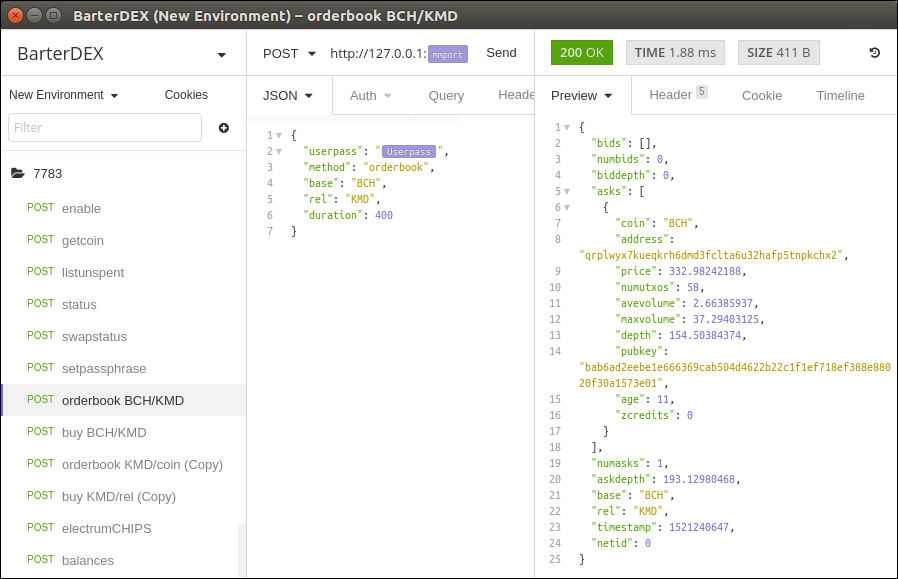

Download Insomnia here: https://insomnia.rest. It is available for all platforms. This guide will use Linux as an example.

It is not necessary to have native coin daemons running. As you will see, managing different coins using Electrum in Insomnia is not difficult.

Make sure to follow the above guide: :ref:`cli-manual-installation-guide`. We need to be able to start a marketmaker instance from the command line in order to start using Insomnia.

Setting the passphrase
^^^^^^^^^^^^^^^^^^^^^^

The first call you need to do when you start a marketmaker instance, is to set the passphrase using the ``setpassphrase`` call. Normally, using a CLI, you go to ``~/SuperNET/iguana/dexscripts`` and execute the ``setpassphrase`` script stored there. Now, we are going to open that script and copy the contents to Insomnia.

Go to the ``dexscripts`` folder:

.. code-block:: bash

    cd ~/SuperNET/iguana/dexscripts
    nano setpassphrase

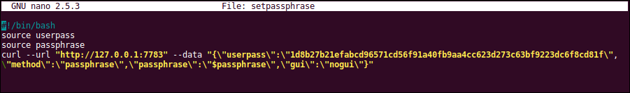

You'll see that this script uses the passphrase as defined in the passphrase file, and that the curl command below it is the RPC issued to the marketmaker instance. It is only this curl command we need in Insomnia.

Copy the following ``setpassphrase`` curl command to your clipboard (it is the same as the one in the dexscripts folder):

.. code-block:: bash
    
    curl --url "http://127.0.0.1:7783" --data "{\"userpass\":\"ef7ca9d596f4d0b504011989c9261330d3ab6c0aa092e779ce6479f8c23cd413\",\"method\":\"passphrase\",\"passphrase\":\"$passphrase\",\"gui\":\"nogui\"}"

Now, go to Insomnia, and create a New Request (Ctrl-N).

.. image:: _static/images/setpassphrase-new-request.png
   :align: center

Name it ``setpassphrase`` and click Create.

Paste the just copied curl command in the textfield area, right next to the the GET dropdown:

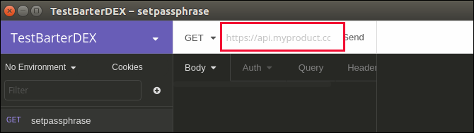

Insomnia recognises this curl command, and automatically extracts the ip-address and the data. Let's call that middle part of Insomnia the input screen. It still looks a bit ugly, so let's make it look better.

Click on Other, and change Other to JSON. 

.. image:: _static/images/setpassphrase-to-json.png
   :align: center

Next, Beautify this JSON:

.. image:: _static/images/setpassphrase-beautify.png
   :align: center

It should result in this:

.. image:: _static/images/setpassphrase-after-beautify.png
   :align: center

Looks better, right? This process of copying a curl command from the ``dexscripts`` folder, creating a new request and pasting the curl command in Insomnia is what you probably need to do for most of the commands, like ``orderbook``, ``buy`` and ``balances``. Actually, all calls as defined in the :ref:`API docs` can be copied into Insomnia.

Now enter your passphrase in the area where the passphrase still is empty, between the 2 quotes. Start a marketmaker instance by running ``./client`` from the `dexscripts` folder and let it boot. When it's done booting, click the Send button in Insomnia for the setpassphrase request.

(if the output on the right side of Insomnia complains that the userpass has not been set, make sure to set the userpass value in the JSON data with ``ef7ca9d596f4d0b504011989c9261330d3ab6c0aa092e779ce6479f8c23cd413``).

This is what you should see in the output part of the screen, when you clicked Send:

.. image:: _static/images/setpassphrase-after-send.png
   :align: center

Fetch the orderbook
^^^^^^^^^^^^^^^^^^^

The next thing you probably want to see, is an orderbook for some pair, like KMD/BTC. Go to the ``dexscripts`` folder again, copy the complete curl command for ``orderbook`` and paste it in a new request. I called this new request ``orderbook KMD/BTC`` and the end result should look like this:

.. image:: _static/images/orderbook-initial.png
   :align: center

Since with KMD/BTC, you're saying you want to buy KMD with BTC, the data in the JSON needs to be changed. Change REVS to KMD and KMD to BTC, such that ``"base": "KMD"`` and ``"rel": "BTC"``. 
You also need to copy the userpass from the ``setpassphrase`` call we did before. On the second line in the output of the ``setpassphrase`` call, you see a userpass value. Copy this value and paste it in the ``orderbook`` request. It should end up like this:

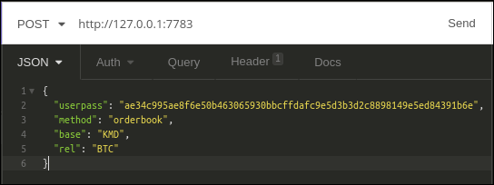

Try Sending this request. It will complain that at least one of the coins is disabled, so we need to enable them. A coin must be explicitly enabled before trades can happen. By default, all coins except KMD and BTC are disabled at startup, which means that if you have a native KMD or BTC daemon running, you don't have to explicitly enable KMD or BTC. If you don't have a KMD daemon, or a BTC daemon, you need to use a Electrum SPV for that. Let's first enable both coins using Electrum.

Go to http://pad.supernet.org/electrum-servers where you'll find a long list of all coins that support Electrum (https://github.com/jl777/coins will contain all electrum servers in the future). Find BTC, copy the curl command and paste it in Insomnia, like you did with the other requests. Do the same for KMD in a new request, such that you end up with 2 requests: electrum BTC and electrum KMD:

.. image:: _static/images/electrum-kmd-btc.png
   :align: center

Click Send for both requests, and if all is right, you'll see a success message for both requests in the output screen.

Now that both coins are enabled (a successful electrum request automatically enables the coin), we can go to the orderbook request and see if something happens. If all is right, you'll see something like this:

.. image:: _static/images/orderbook-output.png
   :align: center

For enabling coins when you have a native coin daemon running, the ``enable`` request is needed. Copy the following curl command in a new Insomnia request, called ``enable <coin>``. I use ZEC in this example.

.. code-block:: bash

   curl --url "http://127.0.0.1:7783" --data "{\"userpass\":\"$userpass\",\"method\":\"enable\",\"coin\":\"ZEC\"}"

This enables ZEC to be used in marketmaker for the current session. If you stop marketmaker and start it again, you need to enable ZEC again before it can be used in marketmaker. This goes for every other coin, except KMD and BTC.

To avoid having to enable coins everytime you start marketmaker, you need to edit the coins file: :ref:`How to edit the coins file`.

Environment variables
^^^^^^^^^^^^^^^^^^^^^

Now that we made a couple of requests, suppose you want to change the passphrase, and consequently the userpass. You'll have to go through every request and change the ``userpass`` value. With 25 requests, this becomes a bit tedious. 

Using environment variables, we can set a variable and use it in each request. This way, you only need to change a value once, and it will apply to all the requests.

Click on No Environment and click Manage Environments (or press Ctrl-E):

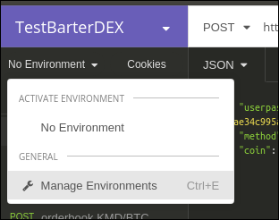

This leads you to the Base Environment, showing an empty JSON file. This JSON file will store all the global variables. Let's make a global ``myuserpass`` variable, containing your userpass.

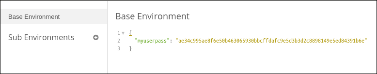

Click Done in the right bottom corner. Now, choose a request and remove the userpass value, but leave the 2 quotes, such that the following appears: ``"userpass": ""``. Start typing ``myuserpass`` in between the quotes, and wait for a dropdown to appear. When it appears, select the ``myuserpass`` value you see:

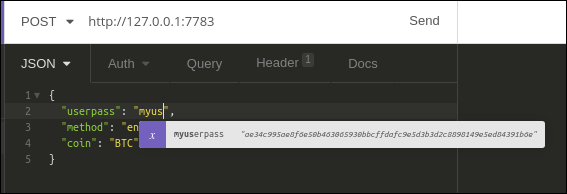

If done correctly, you'll see this purple box appear between the 2 quotes. Do this for all your requests, except the ``setpassphrase`` request, since that requires a default passphrase for initial start-up.

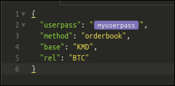

Buy request
^^^^^^^^^^^

We have successfully fetched an orderbook for the KMD/BTC pair. Let's try to buy something.

Copy the following ``buy`` curl and paste it in a new Insomnia request:

.. code-block:: bash

   curl --url "http://127.0.0.1:7783" --data "{\"userpass\":\"{{myuserpass}}\",\"method\":\"buy\",\"base\":\"KMD\",\"rel\":\"BTC\",\"relvolume\":0.005,\"price\":0.0005}"

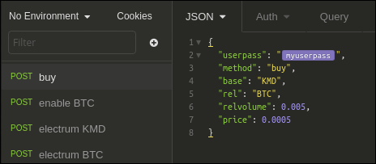

Buying a coin with another coin always happens in pairs: KMD/BTC means that KMD is the base coin and BTC is the rel coin: base/rel. You always buy base with rel, so in this case, you buy KMD with BTC. This means that you need some BTC in your BTC smart address, to be able to buy KMD with it, and you need to have at least 2 BTC transactions in this smart address, because you are paying a small `dexfee` too. 

(For reasons why 2 transactions (UTXOs) are needed, read the :ref:`Overview of the atomic swap protocol`.)

You can get this BTC smart address by selecting the ``setpassphrase`` request and finding the ``"BTC": "<address here>"`` line.

``rel`` and ``relvolume`` are related. The amount of KMD you can buy, depends on the ``relvolume`` you define. A glance at the orderbook will give you an idea about what size ``relvolume`` should be. Also, the amount of KMD you receive is a combination of ``relvolume`` and ``price``. It is a result of a trade, rather than a goal. It is not simply saying: "I want 10 KMD, figure out how much BTC I need to pay". Instead, it is the other way around: "Here is 1 BTC, figure out how much KMD I get".

Take for example this order in the orderbook for KMD/BTC:

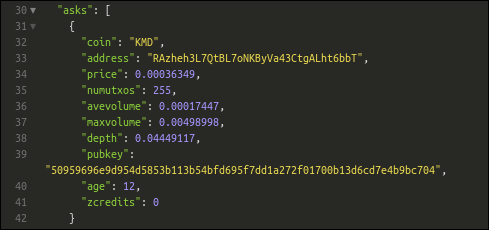

There are three things in this ask that you need to pay attention to:

- ``avevolume`` means the average volume of KMD this seller has to offer, expressed in BTC. This is useful, because you need to define the ``relvolume`` in your buy request as BTC. 
- ``maxvolume`` means that the amount defined here is the largest KMD utxo of this seller.
-  ``depth`` is a phrase commonly used by traders. Here it defines the sum of all KMD utxos from all sellers of KMD, cumulatively.

If you successfully want to buy this order, you need to adapt the ``relvolume`` in your buy request to the volume specified in this order. For this order, it would need to be lower than 0.00498998 BTC. It also depends on the utxo set of the seller, because a seller needs to be able to do a deposit and the actual payment. A deposit is about 13% larger than the actual payment, which means that the seller has to have 2 utxos of about the same size, in order to sell something of that size. To read more about this, read the :ref:`Overview of the atomic swap protocol`.

It is also important to state a ``price`` in your buy request. The price you define here is the maximum price you want to pay for your KMD. Since the order has set a price of 0.00036349, your max price needs to be a little above it, for your request to find willing counterparties to respond.

Now that we know all the information for submitting a ``buy`` request, we can create it. The following should, if the seller has enough utxos and if the atomic swap completes successfully, yield you some KMD (based on the data shown above):

.. code-block:: json

   {
      "userpass": "{{myuserpass}}",
      "method": "buy",
      "base": "KMD",
      "rel": "BTC",
      "relvolume": 0.001,
      "price": 0.00037000
   }

.. note::

   Because of network propagation times and the use of cached data, the data shown in the orderbook is not always 100% up-to-date.

Contrary to centralised exchanges like Binance or Bittrex, submitting the ``buy`` request to the BarterDEX network by  clicking `Send` in Insomnia does not fulfill this order automatically. Instead, what marketmaker does is sending a ``buy request`` onto the decentralised network, to all the other marketmaker nodes your node is connected to. Each node will see this request, and if there is a node that has a price set for this KMD/BTC pair, it will evaluate your request and if it fulfills all requirements (such as price and correct relvolume), it will reply with a message containing a counteroffer. This counteroffer is always better than the ``buy request`` you initially sent, because it falls within the boundaries you set in your ``buy request``.

Your ``buy request`` can have multiple nodes on the marketmaker network respond to it. This all depends on the boundaries you set and the number of marketmaker nodes in the network. Your node then picks the best (lowest) price and starts the trade. 

However! Defining a buy request that fulfills an order from the orderbook will not guarantee you a successful trade. Network issues could stop a trade, as well as out-of-date data from the seller. The orderbook may be stating that a seller has utxos, but in reality someone else could have bought the order already.

// TODO: hidden sellers (orders that exist but are not shown in orderbook)
// TODO: switch pairs, switch price

Folders
^^^^^^^

Filtering
^^^^^^^^^

Electrum calls
^^^^^^^^^^^^^^

History
^^^^^^^

Insomnia stores a list of all the calls you did in the past, including its output. This is useful for debugging and retrieving information you might need at a later stage. 

How to edit the coins file
--------------------------

The coins file contains all the currently supported coins in BarterDEX. It is loaded into marketmaker each time you start it. The file can be edited to your likings, mainly to enable coins on marketmaker startup automatically, without having to enable coins one by one.

Open the coins file with nano:

.. code-block:: bash

   cd ~/SuperNET/iguana/dexscripts
   nano coins

This will show you a list of all coins. Suppose you want to enable ZEC everytime you start marketmaker. You need to add the argument ``\"active\":1,`` to that JSON object, such that it results like this:

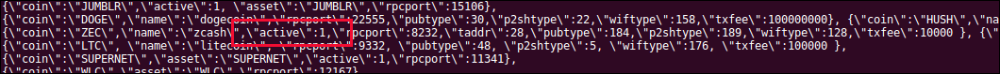

To find a coin in this long list of supported coins, type Ctrl-W to search. 

You can make as many coins active as you like. If the native daemon of an active coin is not running, marketmaker will ignore the coin and leave the coin disabled. 

How to create a new BarterDEX trading network
---------------------------------------------

Since BarterDEX is a decentralized, peer-to-peer network, seeded by some ip-addresses to create the network, others can create a BarterDEX network of their own. This enables people to trade within a private group of traders, or to trade directly from person to person.

See :ref:`new-or-private-network` in the API docs on how to do this. (there currently is no GUI to handle this process)
